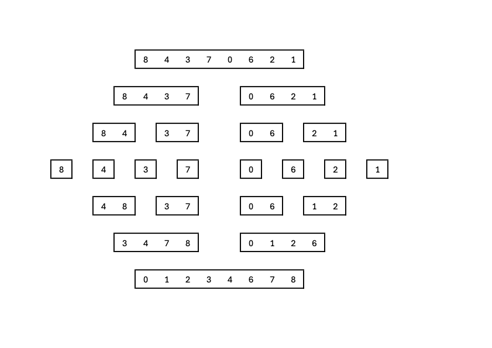

# Merge Sort
Merge sort is a **Divide and Conquer** sorting algorithm.

___

### How It Works
1. **Divide**:
   * Recursively split the array into halves until you get subarrays with a single element (which are inherently sorted arrays, as there are no other elements in these arrays).
2. **Conquer**:
   * Merge two sorted arrays into a single sorted array.
   * Repeat this process recursively until the entire array is merged back together in sorted order.

___

### Visual Diagram



___

### Implementation in C#

```csharp
using System;

namespace DSAExercisesProject.Sorting.MergeSort
{
  class MergeSort
  {
    public static void Sort(int[] arr)
    {
      if (arr.Length <= 1) return; // Base case: array is already sorted
      
      int mid = arr.Length / 2;
      
      // Split the array into left and right halves
      int[] left = new int[mid];
      int[] right = new int[arr.Length - mid];
      
      Array.Copy(arr, 0, left, 0, mid);
      Array.Copy(arr, mid, right, 0, arr.Length - mid);
      
      // Recursively sort both halves
      Sort(left);
      Sort(right);
      
      // Merge the sorted halves back into the original array
      Merge(arr, left, right)
    }
    
    private static void Merge(int[] arr, int[] left, int[] right)
        {
            int i = 0;
            int j = 0;
            int k = 0;
            
            // Compare elements from left and right arrays, and merge them in sorted order
            while (i < left.Length && j < right.Length)
            {
                if (left[i] <= right[j])
                {
                    arr[k++] = left[i++];
                }
                else
                {
                    arr[k++] = right[j++];
                }
            }
            
            // Copy any remaining elements from the left array
            while (i < left.Length)
            {
                arr[k++] = left[i++];
            }
            
            // Copy any remaining elements from the right array
            while (j < right.Length)
            {
                arr[k++] = right[j++];
            }
        }
    
  }
}
```

___

### Analysis

#### Time Complexity

* **Best Case, Worst Case, Average Case**: $O(n \log n)$
  * $O(\log n)$: Recursively divide the array.
  * $O(n)$: Merge operation for each level of recursion.

#### Space Complexity

* $O(n)$: Requires additional memory for temporary arrays during the merge phase.

___

### Advantages

1. **Guaranteed $O(n \log n)$ Time Complexity**: Efficient for large datasets.
2. **Divide and Conquer Approach**: Helps understand recursive problem-solving.

___

### Disadvantages

1. **High Space Complexity**: Requires extra memory for temporary arrays.
2. **Not In-Place**: The array cannot be sorted without additional storage.

___

